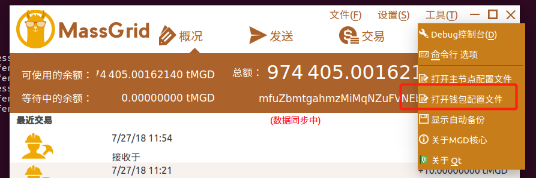

MassGrid masternode windows 搭建过程 - 1.3.3.0
=====================================

## 1. 搭建准备  
#### <font color="#dd0000">(注: 本教程截图来自测试网络,适用于主网,配置文件中个别参数不同,文中已有说明)</font> 
#### (1) 一台具有独立公网ip的服务器   

```
操作系统: ubuntu 16.04
推荐配置: 1核、2G内存 、1Mbps带宽 (最低配置：1核、1G内存、1Mbps)
备注:云服务器安全组策略需要添加放行如下TCP端口: 9442,9443, 19442,19443 
```  

### 2. 具体步骤   

#### (1) 钱包安装      
##### 1) 本地客户端安装最新的测试版钱包 [github下载地址](https://github.com/MassGrid/MassGrid/releases )     
下载对应系统的版本 , (注: 以下三个版本都是已编译好的包含界面的版本)   

如图:   
   

window版:	 [github下载地址](https://github.com/MassGrid/MassGrid/releases/download/MassGrid_1.2.0.1_MainNet/MassGridWallet_1.2.0.1_win.zip)   
Ubuntu16.04_Server 版:	[github下载地址 ](https://github.com/MassGrid/MassGrid/releases/download/MassGrid_1.2.0.1_MainNet/MassGrid_1.2.0.1_a4b2c7_ubuntu16_Server.tar.gz)   
MAC版:	[github 下载地址](https://github.com/MassGrid/MassGrid/releases/download/MassGrid_1.2.0.1_MainNet/MassGridWallet_1.2.0.1_mac.dmg)   


##### 2) Windows服务端安装最新版本的钱包        
下载 上述 1) 中的windwos版钱包,并上传到服务器   
上传步骤:   

	(1) 在本地电脑上，快捷键“WIN+R"-> 输入“MSTSC”，点击确定。   
	(2) 在“远程桌面连接”点击“选项”展开。（"计算机"中输入云服务器的IP地址）   
	(3) 在展开的“远程桌面连接”窗口，点击“本地资源”。   
	(4) 然后点击“详细信息”。   
	(5) 勾选要上传云服务器的文件所在的本地磁盘，点击确定   
	(6) 进行用户名和密码核对后连接上远程云服务器，打开“我的电脑”，就可以看到勾选的本地磁盘映射的盘符。   
	(7) 打开要上传文件所在磁盘，选择要上传的文件，复制之后粘贴到云服务器自带的磁盘上即完成上传。  

##### 3) 启动MGD钱包核心同步区块数据       
打开钱包,选择默认的工作目录,点击确定之后,会在目录中生成对应文件   
配置文件默认位于 `C:/Users/your_name/Documents/MassGridDataDir/`   
(注:  your_name 表示你的用户名)   

-	打开钱包配置文件  
如图:   
    
 
-	添加如下几行:   
	
		rpcuser=usr
		rpcpassword=pwd
		daemon=1
		testnet=1 "#主网请不要填写 (此项用于测试网络下搭建时添加)"    
如图:   
   

#### (2)  <font color="#dd0000">**重启服务端钱包**</font>    

#### (3) 本地创建一个新的钱包地址,记为mnaddress    

打开本地钱包客户端, "**工具**" -> "**Debug控制台**" ,执行以下命令   
```
getaccountaddress mnaddress
```   
如图:   
   

#### (4) 向第(3)步新建的钱包地址mnaddress一次性转入50000MGD   

#### (5) 服务端导入第(3)步创建的地址   
打开服务器钱包客户端, "**工具**" -> "**Debug控制台**" ,执行以下命令
```
importaddress "第(3)步新建的钱包地址mnaddress"
```   
如图:   
   

#### (6) 生成服务端genkey   
打开服务器钱包客户端, "**工具**" -> "**Debug控制台**" ,执行以下命令
```
masternode genkey
```   
如图:   
   

#### (7) 获取第(3)步交易的txid以及对应txindex   
打开服务器钱包客户端, "**工具**" -> "**Debug控制台**" ,执行以下命令
```   
masternode outputs   
```   

#### (8) 打开服务端配置文件massgrid.conf   
添加如下三行内容:   
```   
masternode=1
masternodeprivkey=第(8)步生成的genkey
externalip=你的服务器ip
```   
#### (9) 修改masternode.conf 配置文件      
注:
1. 该配置文件在主网环境，位于 `MassGridDataDir/` 目录下，在测试网络环境，位于 `MassGridDataDir/testnet3/` 目录下   
2. 主网环境下端口号为**9443**

##### 1). 打开服务端 masternode.conf文件   
-	添加内容:(注意: **文件内容为一行,中间空格隔开**)   
如图:(**注: 端口号填写 9443**)   
   
(内容说明: MGD地址标签         服务器IP:端口号        genkey        txid        txindex)   

##### 2). <font color="#dd0000">**配置完成重启服务端钱包**</font>    

##### 3). 本地配置文件   
-	本地钱包的masternode.conf文件中配置一份相同的数据，本地可以通过以下方式打开文件   
如图:   
   
-	添加内容和服务端masternode完全一致:(注意: **文件内容为一行,中间空格隔开**)   
如图:   
   

#### (10) 重启本地钱包客户端   

##### 1). 检查本地钱包是否有主节点页面   
没有的话请执行以下操作：**"设置"**->**"选项"**->**"钱包"**->勾上显示主节点页，**确定并重启钱包**；   
如图:   
   

##### 2). 等待同步完成

##### 3). 启动节点   

1.  点击本地钱包 **"主节点"**-> **"我的主节点"**->选中对应条目-> 点击底部 **"启动节点"**，对应节点状态变为 **"PRE_ENABLE"**   
如图:   
   

#### 4).	经过一段时间（一个小时以内)   
masternode状态会自动转为 **"ENABLE"**   
如图:   
   

#### 5) 主节点收益      
如图:   
   