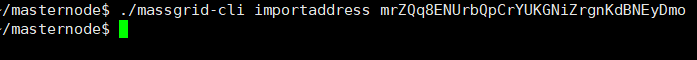
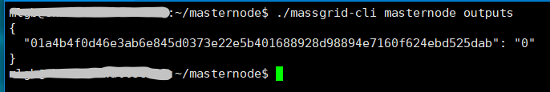
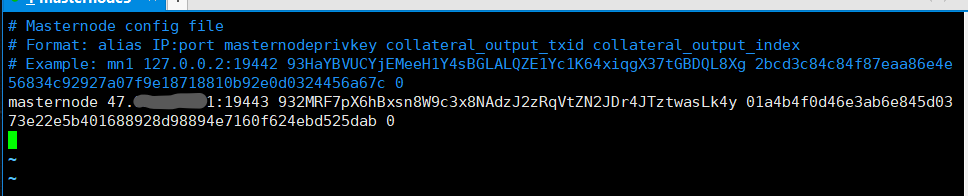

Setup masternode - 1.3.1.3
=====================================

This document describes how to setup your own masternode


### 1. Requirements   

#### (1) Familiar with the basics of the ubuntu operating system (installing software, editing and modifying files)
    
#### (2) A server with a separate public ip   

*    	 Operating system: ubuntu 16.04   
*        Recommended configuration: 1 core, 2G memory, 1Mbps bandwidth (minimum configuration: 1 core, 1G memory,1Mbps bandwidth)    
*	     Cloud Server Security Group Policy needs to add the following TCP ports:9442,9443,19442,19443   

#### (3) **50000** MGD deposit

### 2. Specific steps   

#### (1) Install MGD wallet on the server with a dependent environment    
```
sudo apt-get -y update
sudo apt-get install -y autoconf automake  locales-all
sudo apt-get install -y git build-essential libtool autotools-dev autoconf pkg-config libssl-dev libcrypto++-dev libevent-dev libminiupnpc-dev libgmp-dev
sudo apt-get install -y libboost-all-dev libboost-dev
sudo apt-get install -y software-properties-common python-software-properties
sudo add-apt-repository ppa:bitcoin/bitcoin -y
sudo apt-get update -y
sudo apt-get install -y libdb4.8-dev libdb4.8++-dev
sudo apt-get install -y libqrencode-dev
```   

#### (2) Run the wallet, sync block

##### 1) Local client installs the latest beta wallet [github download address](https://github.com/MassGrid/MassGrid/releases )     
Download the version of the corresponding system , (Note: The following three versions are compiled **client** versions with interfaces)   

   

Test Network Windows version: [MassGrid_Win.zip](https://github.com/MassGrid/MassGrid/releases/download/MassGrid_1.2.0.1_testnet/MassGrid_Win.zip)   
Test Network Ubuntu version 16.04: [MassGrid-Qt_Ubuntu.tar.gz](https://github.com/MassGrid/MassGrid/releases/download/MassGrid_1.2.0.1_testnet/MassGrid-Qt_Ubuntu.tar.gz)   
Test Network Mac: [MassGrid-Qt.dmg](https://github.com/MassGrid/MassGrid/releases/download/MassGrid_1.2.0.1_testnet/MassGrid-Qt.dmg)   

##### 2) Install the latest version of the wallet on the server     
-	Method 1:  Source code compilation and installation  
(optional) If the server memory is lower than 2G, you need to create new virtual memory, otherwise the compilation will not function.   
increase virtual memory.   
```   
dd if=/dev/zero of=/swapfile bs=2M count=1024
#Start virtual memory
mkswap /swapfile
swapon /swapfile
```   
Download the compiled source code    
```   
#Pull source   
git clone https://github.com/MassGrid/MassGrid.git    
#Switch directory   
cd MassGrid  
#Executing the build step
./autogen.sh   
./configure   
make   
```   
(Optional) Deleting the newly created virtual memory.   
```   
swapoff /swapfile
rm /swapfile
```
-	Method 2:  Download the compiled executable directly
Test Network Ubuntu 16.04 Server Edition : [MassGrid_Ubuntu_Server.tar.gz](https://github.com/MassGrid/MassGrid/releases/download/MassGrid_1.2.0.1_testnet/MassGrid_Ubuntu_Server.tar.gz)   
Execute the following two lines of commands:   
```shell   
#Download
wget https://github.com/MassGrid/MassGrid/releases/download/MassGrid_1.2.0.1_testnet/MassGrid_Ubuntu_Server.tar.gz   
#Decompression
tar -zxvf MassGrid_Ubuntu_Server.tar.gz   
```   

##### 3) Start MGD wallet core sync block data       
**The executable file generated after the wallet is compiled is located in the `MassGrid/src` directory**   
Switch to the `MassGrid/src`directory and start the wallet    
```
#Main network use：  
./massgridd   
#Test network usage：   
./massgridd -testnet   
```   

View log   
```   
#Test network usage: 
tail -f ~/MassGridDataDir/testnet3/debug.log
#Main network usage:
 tail -f ~/MassGridDataDir/debug.log
#Exit log view
 ctrl+c
```
Note: The log file will output the CMasternodeSync::ProcessTick — when the synchronization is not completed. If the synchronization is completed, the loading ends.    

#### (3) Create a new wallet address locally, recorded as mnaddress    

Open the local wallet, " Tools " -> " Debug Console ", execute the following command   
```
getaccountaddress mnaddress
```   
   

#### (4) Transfer 50,000MGD to the new wallet mnaddress address at one time   

#### (5) Open the server wallet configuration file massgrid.conf   
(By default `~/MassGridDataDir/` directory，Note：`~`indicate your home directory)   

```   
vi ~/MassGridDataDir/massgrid.conf   
```   
Add the following lines:   
```
rpcuser=usr
rpcpassword=pwd
daemon=1
testnet=1 "#Only add when the test network is built. Do not fill it on the main network"   
```   
   

##### (6)  <font color="#dd0000">**Restart the wallet connected to the server**</font>    

1).	Close the wallet   

```
#Method 1：       
./massgrid-cli stop  
#Method 2: If the massgrid.conf configuration file is modified after the wallet is started, Method 1 might not work. The wallet can be closed with the kill command as follows   
ps -ef | grep massgridd | grep -v grep | cut -c 9-15 | xargs kill
```   
2).  Restart Command   
```
./massgridd  
```   

#### (7) Import the newly created address to the server   

```
./massgrid-cli importaddress "mnaddress"
```   
   

#### (8) Server generated genkey      
enter the following command:    
```
./massgrid-cli masternode genkey
```   
As shown in the figure:   
   

#### (9) Server must obtain de txid from the Step (3) transaction and corresponding txindex with the following command:     
```   
./massgrid-cli masternode outputs   
```   
As shown in the figure:   
   

#### (10) Open the server configurate file:  `MassGridDataDir/massgrid.conf `     
```   
vi ~/MassGridDataDir/massgrid.conf   
```   
Insert the following command:   
```   
masternode=1
masternodeprivkey=genkey (from step (8) )
externalip=Your server’s IP address
```   
   

### (11)Modify the masternode.conf configuration file      
1. The configuration file is located in the main network, look in the directory for `~/MassGridDataDir/` and in the test network it is located at `~/MassGridDataDir/testnet3/`    
2. The port number is **9443** in the main network，and in the test network it is **19443**   

#### 1. Open the server configurate file `masternode.conf`   

```
#Main network   
vi ~/MassGridDataDir/masternode.conf   
#Test network   
vi ~/MassGridDataDir/testnet3/masternode.conf   
```   
-	Server content :( **each space needs to be separated by a spacebar**)   
   
(Content Description: MGD Address   Server IP: Port Number   genkey   txid   txindex)   

#### 2. <font color="#dd0000">**After the completion of the configuration, restart the wallet**</font>    

#### 3. local wallet configure  file
-	Configure the same data in the masternode.conf of the local wallet. And open the file locally as follows，Add the content locally as shown   
   
-	Adding content is exactly the same as the server masternode: (Note: **the content of the file is one line, separated by spaces**)   
   

### (12) Restart the local wallet   

#### 1). Check if the local wallet has a master node page   
Check if the local wallet has a master node page. If not, please do the following：**"Settings"**->**"Options"**->**"Wallet"**->Check the main node page to confirm and restart the wallet，**determined and restart the wallet**；   
   

#### 2).Wait for synchronization to complete

#### 3). Start the wallet   
1.  Click on the local wallet **"masternode"**-> **"my masternode"**->select the corresponding entry-> Click **"start-alias"** at the bottom，the prompt is successful, the corresponding node status changes to **"PRE_ENABLE"**   
As shown in the figure:   
   
2. View the revenue of the masterernode:   
```    
./massgrid-cli masternode status
```    
As shown in the figure:   
   
(Indicates that the masternode has started successfully.)   

#### 4).	After a period of time (within 1 hour)    
the masternode status will automatically change to  **"ENABLE"**   

#### 5) View the revenue of the main node      
   
