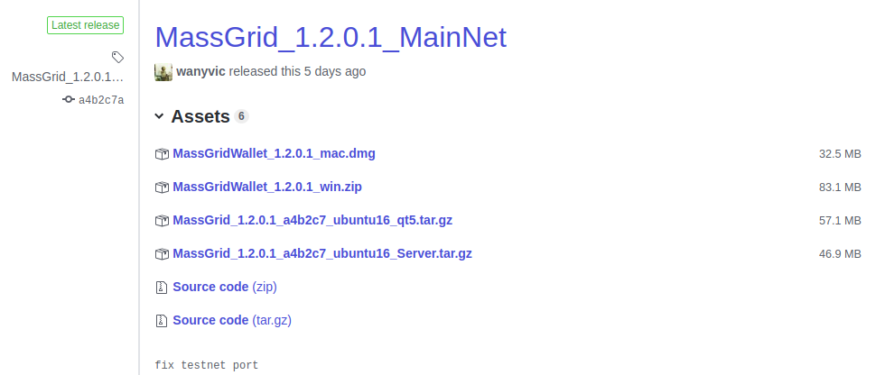
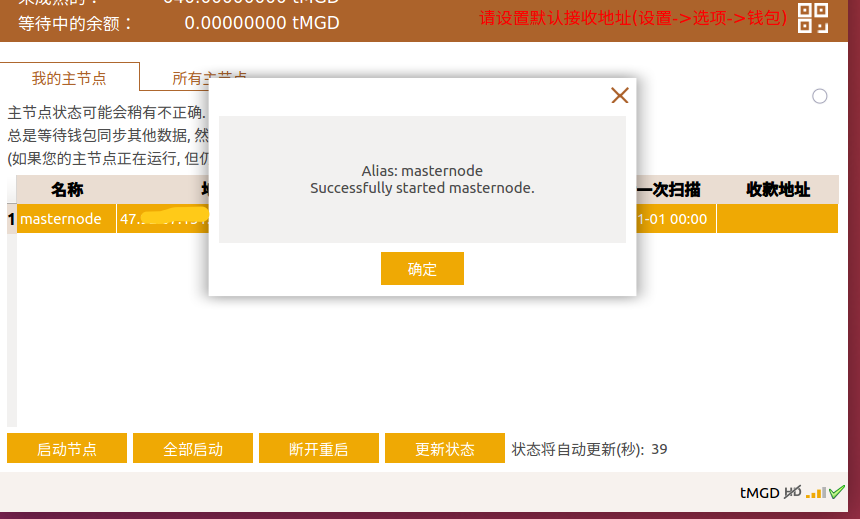
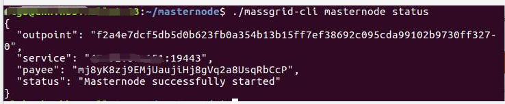
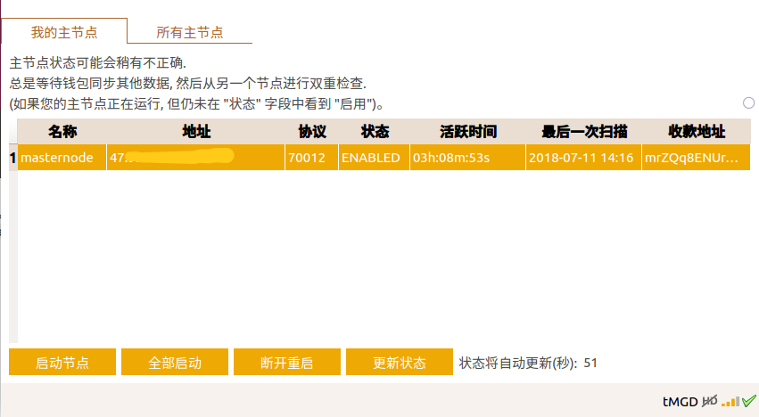

MassGrid masternode 搭建过程 - 1.3.1.3
=====================================

## 1. 搭建准备  
#### <font color="#dd0000">(注: 本教程截图来自测试网络,适用于主网,配置文件中个别参数不同,文中已有说明)</font> 
#### (1) 一台具有独立公网ip的服务器   

```
操作系统: ubuntu 16.04
推荐配置: 1核、2G内存 、1Mbps带宽 (最低配置：1核、1G内存、1Mbps)
备注:云服务器安全组策略需要添加放行如下TCP端口: 9442,9443, 19442,19443 
```  
#### (2) 拥有**50000** MGD   

### 2. 具体步骤   

#### (1) 首先服务器安装MGD钱包运行的依赖环境   
```
sudo apt-get -y update
sudo apt-get install -y autoconf automake  locales-all
sudo apt-get install -y git build-essential libtool autotools-dev autoconf pkg-config libssl-dev libcrypto++-dev libevent-dev libminiupnpc-dev libgmp-dev
sudo apt-get install -y libboost-all-dev libboost-dev
sudo apt-get install -y software-properties-common python-software-properties
sudo add-apt-repository ppa:bitcoin/bitcoin -y
sudo apt-get update -y
sudo apt-get install -y libdb4.8-dev libdb4.8++-dev
sudo apt-get install -y libqrencode-dev
```   

#### (2) 运行钱包核心,同步区块
##### 1) 本地客户端安装最新版本钱包 [github下载地址](https://github.com/MassGrid/MassGrid/releases )     
下载对应系统的版本 , (注: 以下三个版本都是已编译好的包含界面的**客户端**版本)   

如图:   
   

window版:	 [github下载地址](https://github.com/MassGrid/MassGrid/releases/download/MassGrid_1.2.0.1_MainNet/MassGridWallet_1.2.0.1_win.zip)   
Ubuntu16.04_Server 版:	[github下载地址 ](https://github.com/MassGrid/MassGrid/releases/download/MassGrid_1.2.0.1_MainNet/MassGrid_1.2.0.1_a4b2c7_ubuntu16_Server.tar.gz)   
MAC版:	[github 下载地址](https://github.com/MassGrid/MassGrid/releases/download/MassGrid_1.2.0.1_MainNet/MassGridWallet_1.2.0.1_mac.dmg)   

##### 2) 服务端安装最新版本的钱包   
**直接下载编译好的可执行文件**   
Ubuntu16.04 Server版:    [github下载地址 ](https://github.com/MassGrid/MassGrid/releases/download/MassGrid_1.2.0.1_MainNet/MassGrid_1.2.0.1_a4b2c7_ubuntu16_Server.tar.gz)   
执行以下两行命令:   
```shell   
#下载
wget https://github.com/MassGrid/MassGrid/releases/download/MassGrid_1.2.0.1_MainNet/MassGrid_1.2.0.1_a4b2c7_ubuntu16_Server.tar.gz   
#解压
tar -zxvf MassGrid_1.2.0.1_a4b2c7_ubuntu16_Server.tar.gz   
```   

##### 3) 启动MGD钱包核心同步区块数据          
```
#主网使用：  
./massgridd  -daemon
#(注: -daemon表示后台运行)   
```   

查看日志   
```   
#主网查看:
 tail -f ~/MassGridDataDir/debug.log
#退出日志查看
 ctrl+c
```
 注:未同步完成时,日志文件将一直输出 CMasternodeSync::ProcessTick -- .......，同步完成,加载结束.   

#### (3) 本地创建一个新的钱包地址,记为mnaddress   

打开本地钱包客户端, "**工具**" -> "**Debug控制台**" ,执行以下命令   
```
#"mnaddress" 表示生成的地址的标签，可以写其他值
getnewaddress mnaddress
```   
如图:   
   
 <font color="#dd0000">**注：生成新的地址之后记得备份钱包！！**</font>

#### (4) 向第(3)步新建的钱包地址mnaddress一次性转入50000MGD   

#### (5) 打开服务端钱包配置文件massgrid.conf   
(默认在 `~/MassGridDataDir/` 目录下，注：`~`表示你的家目录)   

```   
vi ~/MassGridDataDir/massgrid.conf   
```   
添加如下几行:   
```
rpcuser=usr
rpcpassword=pwd
daemon=1
testnet=1 "#主网请不要填写 (此项用于测试网络下搭建时添加)"   
```   

如图:   
   
(**注: 主网搭建节点 请不要填写 testnet=1**)
#### (6)  <font color="#dd0000">**重启服务端钱包核心**</font>    

1).	关闭钱包核心   

```
#方法一:   
./massgrid-cli stop  
#方法二, 如果钱包核心启动之后更改了配置文件,方法一可能会失效,此时可以通过系统kill命令关闭
ps -ef | grep massgridd | grep -v grep | cut -c 9-15 | xargs kill
```   
2).  重启   
```
./massgridd  
```   

#### (7) 服务端导入第(3)步创建的地址   
```
./massgrid-cli importaddress "第(3)步新建的钱包地址mnaddress"
```   
如图:    
   

#### (8) 生成服务端genkey   

```
./massgrid-cli masternode genkey
```   
如图:   
   

#### (9) 获取第(3)步交易的txid以及对应txindex   

```   
./massgrid-cli masternode outputs   
```   
如图:   
   

#### (10) 打开服务端配置文件massgrid.conf   

```   
vi ~/MassGridDataDir/massgrid.conf   
```   
添加如下三行内容:   
```   
masternode=1
masternodeprivkey=第(8)步生成的genkey
externalip=你的服务器ip
```   
如图:   
   
(**注: 主网搭建节点 请不要填写 testnet=1**)

#### (11) 修改masternode.conf配置文件      

注:
该配置文件在主网环境，位于 `~/MassGridDataDir/` 目录下 (测试网络环境，位于 `~/MassGridDataDir/testnet3/` 目录下)   
####  主网环境下端口号请填写 **9443**  
(测试网络下端口号为**19443**)   

##### 1). 打开服务端masternode.conf文件   
```
#主网   
vi ~/MassGridDataDir/masternode.conf   
```   
-	添加内容:(注意: **文件内容为一行,中间空格隔开**)   
如图:   
   
(内容说明: MGD地址标签        服务器IP:端口号       genkey       txid       txindex) (**注: 端口号填写 9443**) 

##### 2). <font color="#dd0000">**配置完成重启服务端钱包**</font>    

##### 3). 本地配置文件   
-	本地钱包的masternode.conf文件中配置一份相同的数据，本地可以通过以下方式打开文件   
如图:   
   
-	添加内容和服务端masternode完全一致:(注意: **文件内容为一行,中间空格隔开**)   
如图:   
   
(**注: 端口号填写 9443**)   

**附：**
**如果搭建多个节点，本地钱包 `masternode.conf`配置文件，如下图所示，每行表示一个节点，注意每行第一个字段不能重复**
如图:   
   
#### (12) 重启本地钱包客户端   

##### 1). 检查本地钱包是否有主节点页面   
没有的话请执行以下操作：**"设置"**->**"选项"**->**"钱包"**->勾上显示主节点页，**确定并重启钱包**；   
如图:   
   

##### 2). 等待同步完成

##### 3). 启动节点   

1.  点击本地钱包**"主节点"**-> **"我的主节点"**->选中对应条目-> 点击底部 **"启动节点"**，对应节点状态变为 **"PRE_ENABLE"**   
如图:   
   
2. 查看服务端状态, 在服务端输入:   
```    
./massgrid-cli masternode status
```    
如图:   
   
(表示 masternode 启动成功)   

#### 4).	经过一段时间（一个小时以内)   
masternode状态会自动转为 **"ENABLE"**   
如图:   
   

#### 5) 主节点收益      
如图:   
   
### 附: 

##### 1. 主节点搭建完成启动之后，保证服务器节点一直在线即可，本地节点存放私钥仅用来启动主节点并保证币的安全，不必一直在线。
##### 2. 每个主节点会周期性的发出ping消息,通知网络它在线，超过一个小时没有发出，就会变成 `EXPRIED` (过期) 状态，超过三个小时没有发出，就会变成`NEW_START_REQUIRED`状态，需要手动重启节点才可以生效
##### 3. 本地节点状态和服务器状态不一致，一般由于本地节点长时间运行，但是电脑断网(例如，电脑睡眠）导致本地显示不正确
(1) 可以通过服务器查看节点状态   
(2) 先关闭本地钱包，删除钱包目录下  `mncache.dat` `mnpayments.dat`,然后重启钱包    
##### 4. 主节点收益，收益发放地址即50000MGD锁币地址，不能更换其他，每次有新区块产生都会计算所有masternode的排名。主节点收益支付大致过程，首先选取自上次支付收益以来等待时间最长的合格节点的10%，然后根据其他参数，随机选择一个支付收益。因此节点稳定运行时间越长，收益越稳定，接近于平均值。
##### 5. 节点可以随时搭建，节点收益分配比例 10%,15%......是根据区块高度确定的。
##### 6. 撤出节点，清除本地钱包主节点配置文件 ```masternode.conf``` 内容,  然后重启钱包, 锁定的币就可以转出，一旦被锁定的50000的那笔转账被花费，节点会立即失效。